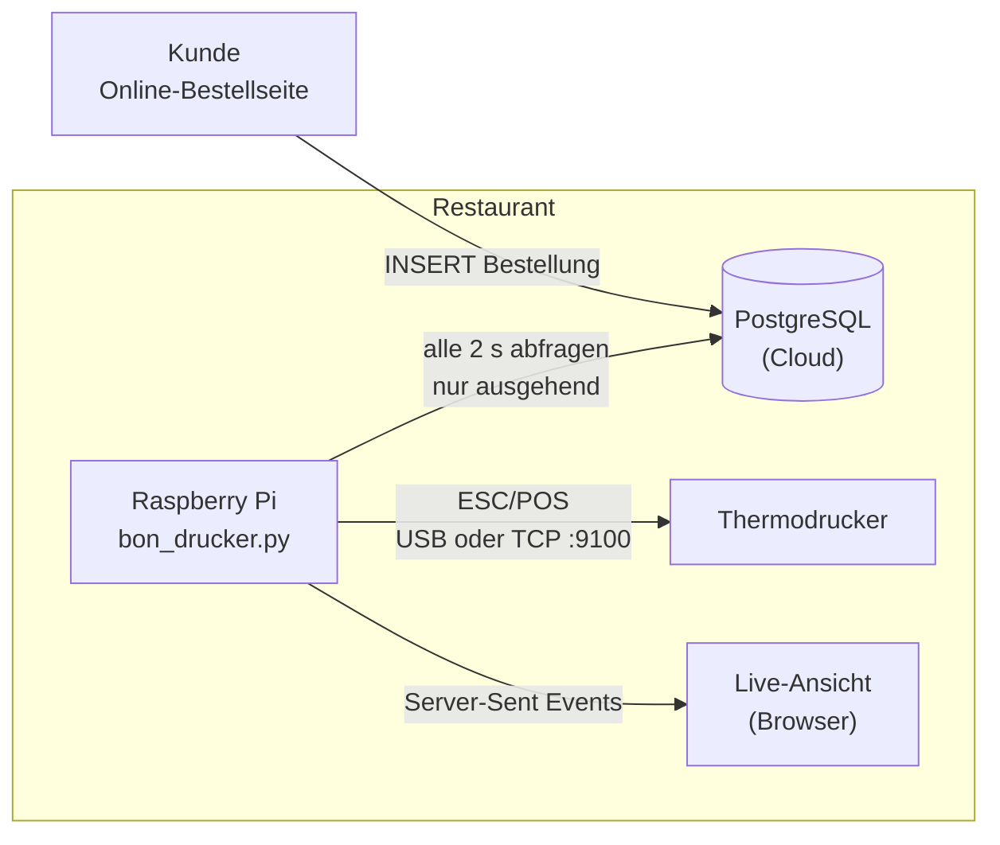

# Bon-Drucker — Drucker-Bridge für Bestellungen

Ein kleiner, ressourcenschonender Dienst, der eine Online-Bestelldatenbank überwacht, jede neue Bestellung in einen Druckauftrag umwandelt und einen Küchen-/Lieferbon auf einem Thermodrucker ausgibt. Zusätzlich gibt es eine Live-Browseransicht, in der der Bon während des Druckvorgangs animiert dargestellt wird.

Das Projekt ist dafür ausgelegt, auf einem **Raspberry Pi im Restaurant** zu laufen. Für die Entwicklung kann es unverändert auf jedem PC mit einem **virtuellen Drucker** betrieben werden (die Browseransicht übernimmt dabei die Funktion des Druckers).


## Warum gibt es das?

Ein Online-Shop befindet sich in der Cloud, während der Küchendrucker in einem Raum hinter einem Router steht. Das Restaurant benötigt einen Papierbon, sobald eine bezahlte Bestellung oder eine Bestellung mit Barzahlung bei Lieferung eingeht — **ohne Ports zu öffnen, ohne VPN und ohne dieselbe Bestellung zweimal zu drucken**.

## Architektur



## Komponenten

| Komponente        | Aufgabe                                                                                                                  |
| ----------------- | ------------------------------------------------------------------------------------------------------------------------ |
| Online-Shop       | Schreibt Bestellungen in die Datenbank (nicht Bestandteil dieses Repositories)                                           |
| PostgreSQL        | Zentrale Datenquelle; enthält auch die `print_jobs`-Warteschlange                                                        |
| `bon_drucker.py`  | Ruft Bestellungen ab, erstellt und verarbeitet Druckaufträge, rendert und druckt Bons und stellt die Live-Ansicht bereit |
| `receipt_ui.html` | Live-Ansicht: animierter Bon, Verlauf und „Testbon“-Button                                                               |
| Drucker           | Jeder ESC/POS-Thermodrucker (USB oder Netzwerk)                                                                          |

## Funktionsweise

1. **Einreihen (Enqueue)** — alle `POLL_SECONDS` Sekunden erstellt der Worker einen `print_jobs`-Eintrag für jede Bestellung, die

   * innerhalb der letzten `MAX_AGE_HOURS` Stunden erstellt wurde,
   * keinen Status aus `SKIP_STATUSES` hat (z. B. storniert) und
   * entweder bezahlt wurde (`PAID_STATUSES`) **oder** per Nachnahme/Barzahlung bei Lieferung (`CASH_METHODS`) erfolgt.

2. **Übernehmen (Claim)** — ein atomisches `UPDATE … FOR UPDATE SKIP LOCKED` weist bis zu 5 Aufträge zu. Kein Auftrag wird jemals zwei Workern gleichzeitig zugewiesen.

3. **Rendern** — Bestellung, Artikel und Adresse werden geladen und als Text mit fester Zeichenbreite formatiert (`RECEIPT_WIDTH` Zeichen; 32 ≈ 58 mm Papier, 42–48 ≈ 80 mm).

4. **Drucken** — der Bon wird an den Drucker (`virtual`, `usb` oder `network`) gesendet und gleichzeitig in der Live-Ansicht dargestellt.

5. **Bestätigen (Acknowledge)** — der Auftrag wird als `printed` markiert. Bei einem Fehler wird er wieder auf `pending` gesetzt und bis zu fünfmal erneut versucht. Danach wird er als `failed` markiert und `last_error` gespeichert.

Zustände eines Druckauftrags:

`pending → printing → printed` oder `failed`

### Beispiel-Bon (80 mm, 42 Zeichen)

```text
                LIEFERDIENST
                 LIEFERUNG
------------------------------------------
Nr. A1B2C3D4              08.10.2026 18:42
------------------------------------------
Max Müller
Tel: 0221 1234567
Hauptstraße 12
50667 Köln
Hinweis: 3. OG, links
------------------------------------------
2x Döner Teller                    19,00 €
1x Café Latte mit Hafermilch und    3,90 €
   extra Sirup
1x Ayran                            4,50 €
------------------------------------------
Zwischensumme                      27,40 €
Lieferung                           3,50 €
MwSt.                               1,79 €
SUMME                              30,90 €
------------------------------------------
BAR KASSIEREN: 30,90 €
Anmerkung:
Bitte ohne Zwiebeln, Klingel defekt:
anrufen.

              Guten Appetit!
```

Die Zahlungszeile zeigt dem Fahrer, was zu tun ist:

`BEREITS BEZAHLT`, `BAR KASSIEREN: <Betrag>` oder `ZAHLUNG OFFEN`.

## Schnellstart (ohne Datenbank und ohne Drucker)

```bash
python bon_drucker.py --demo
```

Öffne anschließend `http://127.0.0.1:8765` und klicke auf **Testbon**.

Der Demo-Modus benötigt lediglich die Python-Standardbibliothek (Python 3.9+).

## Betrieb mit einer Datenbank

```bash
python -m venv .venv
source .venv/bin/activate          # Windows: .venv\Scripts\activate
pip install -r requirements.txt
cp .env.example .env               # anschließend DATABASE_URL usw. bearbeiten
python bon_drucker.py
```

`bon_drucker.py` und `receipt_ui.html` müssen sich im selben Ordner befinden.

Eine `.env`-Datei neben dem Skript wird automatisch geladen. Variablen, die direkt im Terminal gesetzt wurden, haben Vorrang.

## Konfiguration

| Variable                    | Standardwert            | Bedeutung                                                                              |
| --------------------------- | ----------------------- | -------------------------------------------------------------------------------------- |
| `DATABASE_URL`              | –                       | PostgreSQL-Verbindungsstring (erforderlich, außer bei `--demo`)                        |
| `PRINTER`                   | `virtual`               | `virtual`, `usb` oder `network`                                                        |
| `PRINTER_HOST`              | –                       | IP-Adresse/Hostname eines Netzwerkdruckers (Port 9100)                                 |
| `USB_VENDOR`, `USB_PRODUCT` | –                       | Hex-IDs eines USB-Druckers (siehe `lsusb`)                                             |
| `PRINTER_PROFILE`           | `default`               | Druckerprofil für python-escpos (beeinflusst Codepage: `€`, `ä ö ü`)                   |
| `RECEIPT_WIDTH`             | `42`                    | Zeichen pro Zeile                                                                      |
| `POLL_SECONDS`              | `2`                     | Intervall für die Datenbankabfrage                                                     |
| `MAX_AGE_HOURS`             | `6`                     | Ältere Bestellungen werden nie gedruckt (verhindert eine Druckflut nach einem Ausfall) |
| `PAID_STATUSES`             | `paid`                  | Werte von `payment_status`, die als bezahlt gelten                                     |
| `CASH_METHODS`              | `cash,cash_on_delivery` | Werte von `payment_method`, die auch bei unbezahlten Bestellungen gedruckt werden      |
| `SKIP_STATUSES`             | `cancelled`             | Bestellstatus, die niemals gedruckt werden                                             |
| `BUSINESS_NAME`             | `LIEFERDIENST`          | Überschrift auf dem Bon                                                                |
| `TZ_NAME`                   | `Europe/Berlin`         | Zeitzone für den gedruckten Zeitstempel                                                |
| `STATE_DIR`                 | `.`                     | Speicherort für `printed_orders.txt`                                                   |
| `UI_HOST`, `UI_PORT`        | `127.0.0.1`, `8765`     | Adresse und Port der Live-Ansicht                                                      |
| `LINE_MS`                   | `140`                   | Geschwindigkeit der Druckanimation                                                     |

## Erwartetes Datenbankschema

Der Dienst erstellt die Tabelle `print_jobs` selbst.

Er **liest** folgende Tabellen (passe die SQL-Konstanten am Anfang von `bon_drucker.py` an, falls deine Tabellen anders aufgebaut sind):

| Tabelle              | Verwendete Spalten                                                                                                                                                                                                                 |
| -------------------- | ---------------------------------------------------------------------------------------------------------------------------------------------------------------------------------------------------------------------------------- |
| `orders`             | `id` (uuid), `order_type` (`delivery`/`pickup`), `status`, `payment_status`, `payment_method`, `subtotal`, `tax`, `total`, `delivery_fee`, `customer_name`, `customer_phone`, `customer_note`, `delivery_address_id`, `created_at` |
| `delivery_addresses` | `id`, `street`, `house_number`, `postal_code`, `city`, `notes`                                                                                                                                                                     |
| `order_items`        | `order_id`, `product_name_snapshot`, `quantity`, `unit_price_snapshot`                                                                                                                                                             |

## Betrieb im Restaurant auf einem Raspberry Pi

### Netzwerk

Der Pi stellt ausschließlich **ausgehende Verbindungen** zur Datenbank her.

Es ist keine Portweiterleitung und keine öffentliche IP erforderlich. Das System funktioniert hinter jedem normalen Restaurant-Router.

### 1. Drucker anschließen

| Verbindung                   | Einrichtung                                                                                                                                                                           |
| ---------------------------- | ------------------------------------------------------------------------------------------------------------------------------------------------------------------------------------- |
| **USB**                      | `PRINTER=usb` setzen und `USB_VENDOR`/`USB_PRODUCT` anhand von `lsusb` konfigurieren. Benötigt `libusb` und eine udev-Regel, damit der Service-Benutzer auf das Gerät zugreifen kann. |
| **Netzwerk** (Ethernet/WLAN) | `PRINTER=network` und `PRINTER_HOST=<Drucker-IP>` setzen. Dem Drucker eine statische IP oder eine DHCP-Reservierung geben. ESC/POS wird über den TCP-Port 9100 übertragen.            |

Der Drucker wird für jeden Auftrag neu geöffnet. Wenn er ausgesteckt oder neu gestartet wird, muss der Dienst daher nicht neu gestartet werden.

### 2. Installation

```bash
sudo apt install python3-venv libusb-1.0-0
sudo mkdir -p /opt/bon-drucker && sudo chown $USER /opt/bon-drucker
git clone <dieses-repo> /opt/bon-drucker && cd /opt/bon-drucker
python3 -m venv .venv && . .venv/bin/activate
pip install -r requirements.txt python-escpos pyusb
cp .env.example .env && chmod 600 .env     # bearbeiten
```

### USB-Berechtigungen

Beispiel für den Hersteller `04b8` — verwende deine eigene ID:

```text
# /etc/udev/rules.d/99-receipt-printer.rules
SUBSYSTEM=="usb", ATTR{idVendor}=="04b8", MODE="0666"
```

### 3. Als Service ausführen

```ini
# /etc/systemd/system/bon-drucker.service
[Unit]
Description=Bon-Drucker
After=network-online.target
Wants=network-online.target

[Service]
User=pi
WorkingDirectory=/opt/bon-drucker
ExecStart=/opt/bon-drucker/.venv/bin/python bon_drucker.py
Restart=always
RestartSec=5

[Install]
WantedBy=multi-user.target
```

```bash
sudo systemctl enable --now bon-drucker
journalctl -u bon-drucker -f
```

### 4. Datenbankbenutzer mit minimalen Rechten verwenden

Gib dem Pi **nicht** deine Admin-Zugangsdaten.

Erstelle stattdessen einen eigenen Benutzer:

```sql
CREATE ROLE bon_drucker LOGIN PASSWORD '…';
GRANT SELECT ON orders, order_items, delivery_addresses TO bon_drucker;
GRANT SELECT, INSERT, UPDATE ON print_jobs TO bon_drucker;
GRANT USAGE ON SEQUENCE print_jobs_id_seq TO bon_drucker;
```

Der anfängliche `CREATE TABLE IF NOT EXISTS`-Aufruf benötigt möglicherweise `CREATE`-Rechte auf das Schema.

Wenn du `print_jobs` selbst erstellst, kannst du diesen Aufruf entfernen.

### 5. Vor dem Produktiveinsatz testen

Einmal mit `PRINTER=usb` (oder `network`) starten, eine Testbestellung aufgeben und überprüfen, ob Umlaute und das `€`-Zeichen korrekt auf dem Papier erscheinen.

Wenn sie falsch gedruckt werden, setze `PRINTER_PROFILE` auf das passende Druckermodell.

## Zuverlässigkeitskonzept

| Problem                                        | Lösung                                                                            |
| ---------------------------------------------- | --------------------------------------------------------------------------------- |
| Bestellung wird zweimal gedruckt               | `UNIQUE(order_id)` in der Warteschlange + `FOR UPDATE SKIP LOCKED`                |
| Absturz während des Druckens                   | Aufträge, die länger als 2 Minuten in `printing` stehen, werden erneut übernommen |
| Datenbank nicht erreichbar                     | Worker verbindet sich neu und versucht es alle `POLL_SECONDS` erneut              |
| Gedruckt, aber Datenbank-Update fehlgeschlagen | Lokale `printed_orders.txt` verhindert einen erneuten Druck                       |
| Drucker offline                                | Bis zu 5 Versuche, danach `failed` mit `last_error` zur Fehlerüberwachung         |
| Neustart / Stromausfall                        | Der Status liegt in der Datenbank; der Service wird über systemd neu gestartet    |
| Zu viele alte Bestellungen nach Ausfall        | `MAX_AGE_HOURS` ignoriert alte Bestellungen                                       |

Ergebnis: **At-least-once-Zustellung mit Duplikatvermeidung**, also praktisch genau einmal.

## Bekannte Einschränkungen

* **Fire-and-forget-Druck:** ESC/POS ist hier unidirektional. „Gedruckt“ bedeutet, dass der Drucker die Daten akzeptiert hat, nicht dass tatsächlich Papier ausgegeben wurde. Papiermangel oder eine geöffnete Abdeckung werden nicht erkannt.
* **Live-Ansicht ohne Authentifizierung:** Standardmäßig wird sie nur an `127.0.0.1` gebunden. Bons enthalten Namen, Telefonnummern und Adressen — die Live-Ansicht sollte daher nicht ohne VPN oder einen authentifizierten Reverse Proxy in einem gemeinsam genutzten Netzwerk erreichbar sein.
* **Polling statt Push:** Dies wurde bewusst gewählt, damit das System auch mit Connection-Poolern wie PgBouncer funktioniert und keine eingehenden Verbindungen benötigt.
* **Ein Drucker pro Instanz.**
* **Hardware-Backends müssen mit dem jeweiligen Druckermodell getestet werden** (siehe Schritt 5).

## Projektstruktur

```text
bon_drucker.py     # Worker, Warteschlangenlogik, Bon-Layout, Drucker-Backends, HTTP/SSE-Server
receipt_ui.html    # Live-Ansicht (Vanilla JS, kein Build-Schritt)
.env.example       # Konfigurationsvorlage
requirements.txt   # psycopg (+ tzdata unter Windows)
```

## Status

* Entwickelt und auf einem PC im virtuellen Druckermodus getestet (Simulation des Raspberry Pi).
* USB-/Netzwerkdruck wird mit [python-escpos](https://python-escpos.readthedocs.io/) unterstützt, wurde bisher jedoch noch nicht mit einem physischen Drucker getestet.
